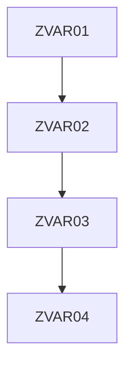

# abap2batchjobs
ABAP to batch jobs

## Overview

SAP ABAP batch jobs in Program

### Excel files

### Tables 

Table : `ZZABAP02TB5001` : Batch job Setting Table.

### Program

**Execution Prog**

ABAP Program, execute in Variants

[code @zzabap02batchr010.prog.abap](/src/zzabap02batchr010.prog.abap)

**Job Setting Prog**

Batch Setting Program

Get Table `ZZABAP02TB5001`

[code @zzabap02batchr011.prog.abap](/src/zzabap02batchr011.prog.abap)

## Job Overview

Tcode : `SM37`

